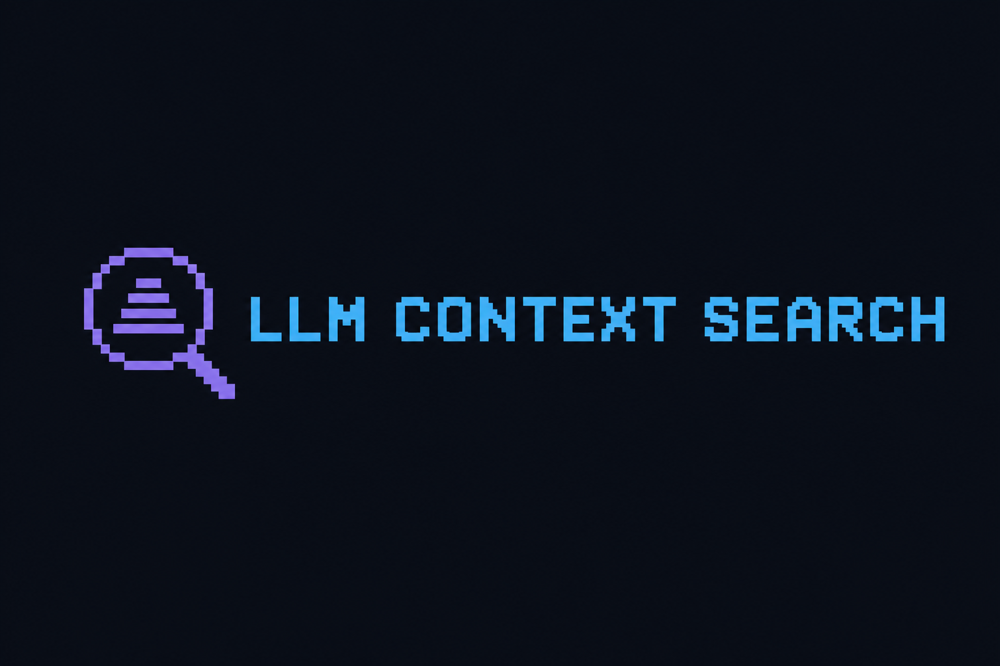

<p align="center">
  
</p>

# llm-context-search

**Turn a search query into ranked, token-bounded context for your LLM - no LLM required for retrieval, MCP server included.**

[](https://github.com/rorlikowski/llm-context-search/actions/workflows/ci.yml)
[](https://pypi.org/project/llm-context-search/)
[](https://pypi.org/project/llm-context-search/)
[](LICENSE)

```bash
pip install llm-context-search
docker compose up -d          # start SearXNG
llm-context build "your query"
```

---

## Quick example

Search for Python asyncio best practices, fetch the top 5 pages, extract main
content, rank the most relevant passages, and pack them into a 4 000-token
context block. One command.

```bash
llm-context build "Python asyncio best practices" \
  --max-sources 5 --budget 4000 -o context.md
```

```text
  Searching…  done   10 results → 5 unique
  Fetching…   done   5/5 pages fetched
  Extracting… done   5 ok, 0 failed
  Ranking…    done   38 passages → 11 selected

Context saved to context.md - ~3 912 tokens, 4 831 ms
```

The output is Markdown, grouped by source with relevance scores - ready to paste into any LLM prompt.

Or call it from your agent as an MCP tool:

```json
{
  "tool": "build_context",
  "arguments": {
    "query": "Python asyncio best practices",
    "budget_tokens": 4000
  }
}
```

---

## Why llm-context-search?

- **No LLM needed for retrieval.** The full search → fetch → extract → rank →
  pack pipeline is pure Python. No API keys, no inference costs, no rate limits
  during context building.
- **MCP server out of the box.** Drop the `llm-context-mcp` command into Cursor
  or Claude Desktop and your agent can call `build_context`, `search`, and
  `collect_sources` directly - without writing any integration code.
- **Token budget, not page count.** The packer selects the highest-scoring
  passages that fit within your token budget, so the context is always the right
  size for your model.
- **Self-hosted, privacy-first.** Connects to your own
  [SearXNG](https://searxng.github.io/searxng/) instance. Queries and page
  content never leave your infrastructure.
- **Every stage is swappable.** Provider, fetcher, extractor, chunker, ranker,
  scorer and packer are all `Protocol`s. Pass your own implementation to
  `ContextSearchEngine` and the rest of the pipeline keeps working.

---

## Install

```bash
# from PyPI
pip install llm-context-search

# with uv
uv add llm-context-search

# for development, from source
git clone https://github.com/rorlikowski/llm-context-search && cd llm-context-search
uv sync --extra dev
```

Requires Python 3.11+.

---

## The 60-second tour

### CLI

```bash
# Search only – no page fetching
llm-context search "Python GIL" --max-results 10

# Fetch pages, show extraction status per source
llm-context collect "Python GIL" --max-sources 5 --verbose

# Full pipeline – print context to stdout
llm-context build "Python GIL" --budget 4000

# Save context to file, output JSON stats
llm-context build "Python GIL" --budget 4000 -o context.md --json
```

### MCP server (Cursor / Claude Desktop)

Add to `~/.cursor/mcp.json`:

```json
{
  "mcpServers": {
    "llm-context-search": {
      "command": "llm-context-mcp",
      "env": { "SEARXNG_URL": "http://localhost:8888" }
    }
  }
}
```

Your agent now has three tools: `search`, `collect_sources`, `build_context`.

For remote deployments, run the HTTP transport instead:

```bash
LCS_MCP_TRANSPORT=http FASTMCP_PORT=9000 llm-context-mcp
```

---

## Pipeline

Every query goes through the same stages:

```
query
  → SearXNGProvider           search n results
  → URL normalisation          lowercase, strip tracking params, remove default ports
  → deduplication              drop exact and near-duplicate URLs
  → PageFetcher                async concurrent fetch with SSRF protection
  → TrafilaturaExtractor       extract main article text (BS4 fallback)
  → SourceQualityScorer        heuristic score per source (https, length, title match…)
  → ParagraphChunker           split into overlapping passage windows
  → LexicalRanker              score by query-term coverage + source quality
  → MarkdownPacker             select top-N passages within token budget
  → ContextBundle              context_text + stats
```

All stages run in a single `asyncio` event loop; page fetching is concurrent
(bounded by `fetch_concurrency`). CPU-bound extraction runs in a thread-pool
executor to keep the loop free.

---

## Replace any component

Every stage sits behind a `Protocol`. Pass your own implementation and the rest
of the pipeline adapts automatically:

```python
from llm_context_search import ContextSearchEngine
from llm_context_search.models import SearchResult, Passage, SourceDocument

class MyProvider:
    name = "brave"

    async def search(
        self, query: str, *, language: str = "en", max_results: int = 10
    ) -> list[SearchResult]:
        ...  # call Brave Search API

class MyRanker:
    def rank(
        self, query: str, passages: list[Passage], sources: dict[str, SourceDocument]
    ) -> list[Passage]:
        ...  # BM25, bi-encoder embeddings, cross-encoder reranker, etc.

engine = ContextSearchEngine(provider=MyProvider(), ranker=MyRanker())
```

| Protocol | Default | Swap to add |
|---|---|---|
| `SearchProvider` | `SearXNGProvider` | Brave, DuckDuckGo, Tavily, … |
| `PageFetcherProtocol` | `PageFetcher` | Playwright, Firecrawl, cache layer, … |
| `ContentExtractor` | `TrafilaturaExtractor` | Jina Reader, custom parser, … |
| `PassageChunker` | `ParagraphChunker` | Sentence splitter, semantic chunker, … |
| `PassageRanker` | `LexicalRanker` | BM25, embeddings, cross-encoder, … |
| `SourceScorer` | `SourceQualityScorer` | Domain allow-list, freshness score, … |
| `ContextPacker` | `MarkdownPacker` | XML, JSON, custom template, … |

---

## Documentation

| Section | What's inside |
|---|---|
| [Installation](docs/install.md) | Docker + SearXNG setup, verification |
| [Quickstart](docs/quickstart.md) | All CLI commands, flags and examples |
| [MCP Server](docs/mcp.md) | Cursor, Claude Desktop, HTTP transport, all tools |
| [Python SDK](docs/python-sdk.md) | Engine API, data models, custom components |
| [Configuration](docs/configuration.md) | Every config option and environment variable |
| [API Reference](docs/api.md) | Auto-generated from docstrings |

The full documentation is published at **[rorlikowski.github.io/llm-context-search](https://rorlikowski.github.io/llm-context-search/)**.

Browse locally with `uv run mkdocs serve`.

---

## Development

```bash
uv sync --extra dev

uv run ruff check src/ tests/      # lint
uv run ruff format src/ tests/     # format
uv run mypy src                    # type-check
uv run pytest                      # test
```

### Publishing a new release

1. Bump `version` in `pyproject.toml` and `src/llm_context_search/__init__.py`.
2. Commit and tag: `git tag v0.2.0 && git push --tags`.
3. The `release` workflow builds, creates a GitHub Release, and publishes to
   PyPI via [Trusted Publishing](https://docs.pypi.org/trusted-publishers/) - no API tokens needed.

---

## License

MIT - see [LICENSE](LICENSE).
