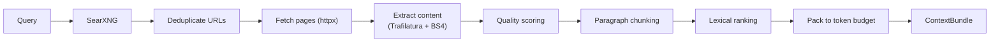

# llm-context-search

**Fast LLM-free search-to-context engine for AI agents - with an MCP server built in.**

`llm-context-search` turns web search results into clean, ranked, and token-bounded context for LLM applications. It searches via SearXNG, fetches pages, extracts main content, ranks relevant passages and packs them into a compact `ContextBundle` - **without calling an LLM**.

Comes with an [MCP server](mcp.md) that any MCP-compatible agent (Cursor, Claude Desktop, etc.) can call directly.

---

## How it works



---

## Key features

- **No LLM required** - pure Python pipeline, runs locally
- **MCP server** - expose the engine as `search`, `collect_sources` and `build_context` tools for any MCP client
- **CLI** - `llm-context build "your query"` gives you context in seconds
- **Python SDK** - embed the engine in your own agent or RAG pipeline
- **Self-hosted** - connects to your own SearXNG instance, nothing leaves your infra
- **Pluggable** - every pipeline stage is a Protocol; swap implementations freely
- **Safe** - SSRF protection, private IP blocking, byte-size limits per fetch

---

## Install

```bash
pip install llm-context-search
```

```bash
uv add llm-context-search
```

Requires **Python 3.11+**. The MCP server (`llm-context-mcp`) is included.

---

## 60-second demo

=== "MCP (Cursor / Claude Desktop)"

    Add to `~/.cursor/mcp.json`:

    ```json
    {
      "mcpServers": {
        "llm-context-search": {
          "command": "llm-context-mcp",
          "env": { "SEARXNG_URL": "http://localhost:8888" }
        }
      }
    }
    ```

    Then ask your agent: *"Search for Python asyncio best practices and build me context."*

=== "CLI"

    ```bash
    docker compose up -d          # start SearXNG
    llm-context build "Python asyncio best practices" --budget 4000
    ```

=== "Python"

    ```python
    import asyncio, httpx
    from llm_context_search import ContextSearchEngine
    from llm_context_search.providers import SearXNGProvider

    async def main():
        async with httpx.AsyncClient() as client:
            engine = ContextSearchEngine(
                provider=SearXNGProvider("http://localhost:8888", client)
            )
            bundle = await engine.build_context("Python asyncio best practices")
            print(bundle.context_text)

    asyncio.run(main())
    ```

---

## Next steps

- [Installation guide](install.md) - Docker + SearXNG setup
- [Quickstart](quickstart.md) - CLI and first query
- [MCP server](mcp.md) - connect Cursor or Claude Desktop
- [Python SDK](python-sdk.md) - embed in your own code
- [Configuration](configuration.md) - all options
